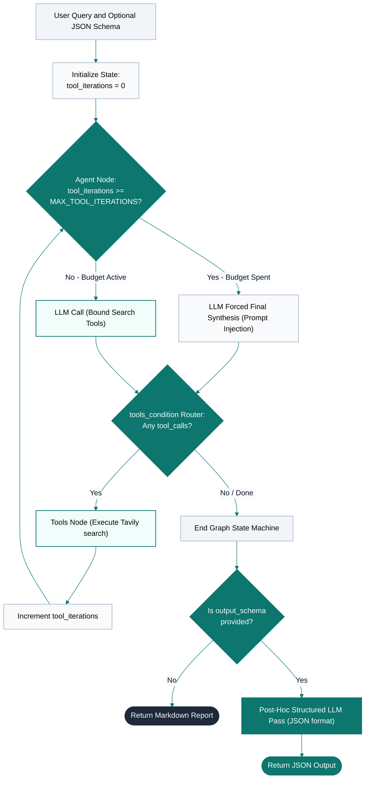
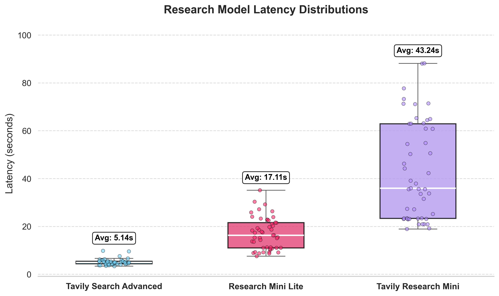
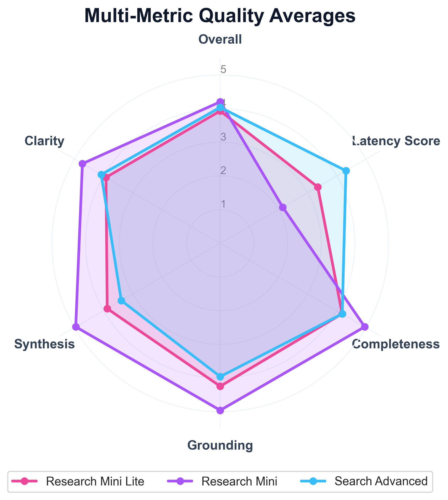
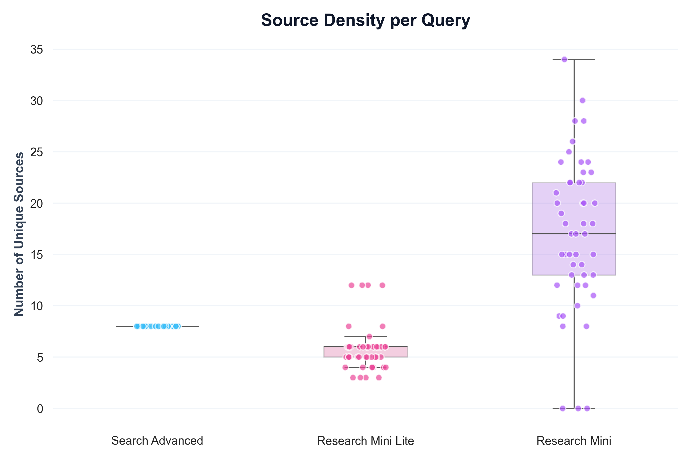
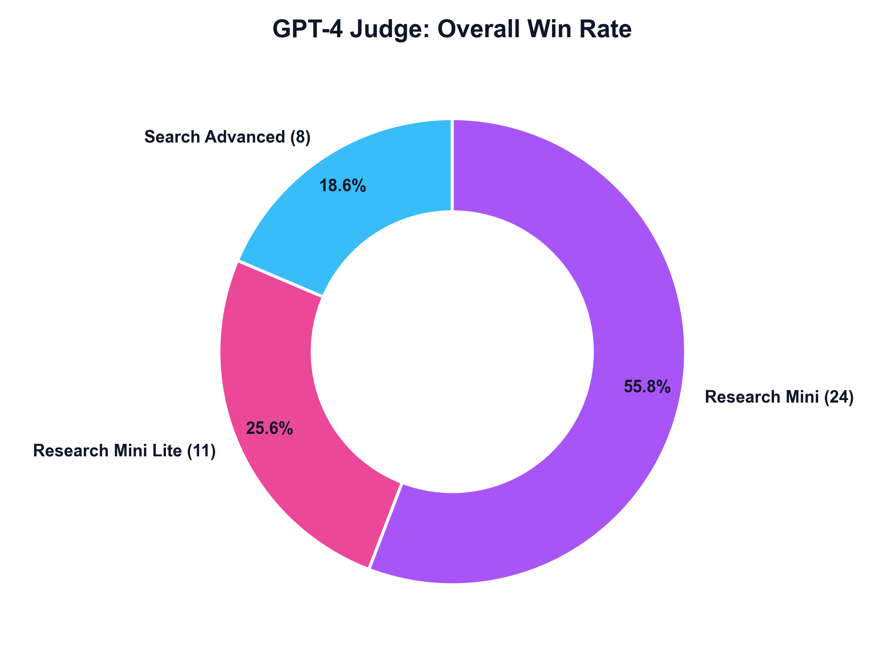

# FDE Assignment: Tavily Research Mini Lite

> **Option 1: Improve an Existing Application**
> This repository contains a highly optimized, bounded research agent implementation (**Research Mini Lite**) designed to bridge the gap between fast single-hop searches and high-latency, high-cost multi-agent research pipelines.

---

## The Core Problem

1. **High Latency for Deep Research**: Tavily Research Mini is extremely thorough but is too slow (~30s to 180s) for conversational search/chat interfaces.
2. **Standard Search is Too Thin**: The standard Tavily `/search` endpoint is fast, but lacks multi-hop reasoning capabilities (gathering facts from source A to query source B) and does not synthesize diverse sources natively.
3. **No Structured Output in Fast Search**: Standard Tavily search does not support arbitrary output schemas (JSON formats), whereas business integrations frequently demand structured data (e.g., comparative matrices, extraction tables).

## The Thesis

**Customers want synthesized, multi-hop, and structured research outputs without the latency and cost of a full Research Mini run.**

**Research Mini Lite** solves this by compiling a LangGraph-bounded agent loop that uses parallelized, single-hop Tavily `/search` calls under a strict iteration budget, followed by a post-hoc single-pass structured extraction.

---

## How It Works

Research Mini Lite runs a stateful research loop using LangGraph:

<div style="max-width: 380px; margin: 0 auto;">



</div>

### Why it is so fast:
1. **Parallel Tool Execution**: When the LLM emits multiple tool calls in a single turn, LangGraph executes them in parallel, enabling multi-aspect search in a single round-trip.
2. **Single-Hop Endpoint**: Instead of polling a long-running research queue, it leverages Tavily's highly optimized `/search` endpoint with a configurable `search_depth` ("basic" or "advanced").
3. **Hard Budget Enforcement**: A `MAX_TOOL_ITERATIONS` guardrail ensures the agent never gets trapped in infinite search loops, forcing a synthesis step when the budget is spent.
4. **Post-Hoc Structured Extraction**: Rather than forcing the entire multi-hop planning loop to output JSON (which degrades reasoning quality and increases token usage/latency), the research runs in freeform markdown. Structured formatting is executed as a single, deterministic final pass only if requested.

---

## Technical Statement & Thought Process

### 1. Approach & Architectural Design
I selected **LangGraph** because research is inherently iterative: finding source $X$ often changes what we need to look up next (multi-hop). To maintain control over costs and latency, we decoupled the **research synthesis phase** from the **schema enforcement phase**:
* **The Research Phase**: Focuses entirely on finding information, validating facts, and generating a readable Markdown report with clear citations.
* **The Extraction Phase**: Standardizes the output into the user-specified JSON Schema in a single structured call using OpenAI's `response_format` constraint.

### 2. Value Creation
* **Technical Value**: Reduces research latency from ~30s to **8-20s** while maintaining multi-hop retrieval and full citations. It significantly reduces token complexity by avoiding recursive structured formatting.
* **Business Value**: Allows conversational AI products to offer "Deep Search" features inline in real-time chat without frustrating the user with long wait times. It reduces API usage costs by using the cheaper `/search` credits rather than `/research` credits.

---

## Project Structure

```text
FDE-Assignment/
  app.py                     # FastAPI application endpoints & configuration
  requirements.txt
  research_mini_lite/
    __init__.py
    agent.py                 # LangGraph agent definitions & loop state
    state.py                 # LangGraph state schema
    evaluation.py            # Automated multi-provider evaluation framework
    prompts/
      researcher.j2          # Custom Jinja2 prompt template for research synthesis
    tools/
      web_search.py          # Configurable Tavily search client
```

---

## Setup & Installation

### 1. Clone & Set Up Environment

```bash
cd FDE-Assignment
python3 -m venv venv
source venv/bin/activate
pip install -r requirements.txt
```
---

## Running the Application

Start the FastAPI application:

```bash
python app.py
```

The server runs on `http://localhost:8000`.

If `LANGSMITH_API_KEY` is set, Research Mini Lite traces API calls, Tavily search, agent synthesis, evaluation provider runs, and quality judging to LangSmith. Check tracing status at:

```bash
curl http://localhost:8000/langsmith/status
```

---

## Evaluation & Benchmarking

The workspace includes a built-in chat app and evaluation UI to benchmark **Tavily Search Advanced**, **Research Mini Lite**, and **Tavily Research Mini**.

1. Start the server: `python app.py`
2. Navigate to `http://localhost:8000` in your web browser.
3. Select or type queries and click **Run Evaluation**.
4. The dashboard records wall-clock latency, source counts, and prompts an LLM-based judge to score output quality (completeness, factual grounding, source quality, synthesis, clarity) from 1 to 5.

Every evaluation run is saved as a full JSON report in the repository-level `eval-reports/` folder. Filenames use the local date and time, for example `2026-06-09_15-04-22.json`.

### Evaluation Metrics

For the full combined report containing all 49 evaluation runs, see [`eval-reports/big_eval.json`](eval-reports/big_eval.json).

#### Model Latency Distributions


#### Multi-Metric Quality Radar


#### Source Density


#### LLM Judge Win Rate


#### Qualitative Comparison

**Positive Case Study: Research Mini Lite Wins**
> **Query:** _Compare the current AI safety policies from OpenAI, Anthropic, Google DeepMind, and Meta._

| Model | Report Snippet | Judge Commentary |
|---|---|---|
| **Search Advanced** | # Tavily Search Advanced Answer <br>  <br> OpenAI’s current safety policy is embodied in its Preparedness Framework v2, which explicitly covers biological, chemical, cybersecurity, and AI self‑improvement risks, incorporates a publicly posted whistleblower policy, mandates external third‑party model evaluations, and includes clear thresholds for halting development when safeguards cannot be applied; Anthropic’s Responsible Scaling Policy v2.2 targets a broader set of threats—including chemical, biological, radiological, nuclear weapons, autonomous AI research and development, and cyber operations—requires rigorous assessment of catastrophic‑risk models, obligates immediate risk‑reduction actions when higher‑level safeguards are unavailable, and has earned the highest safety grades among the four firms despite recent softening of insider‑threat commitments; Google DeepMind’s Frontier Safety Framework v3.0 addresses CBRN hazards, cyber threats, harmful manipulation, machine‑learning R&D, and model misalignment, integrates updated threat‑modeling, empirical risk‑evaluations and oversight by a Responsibility and Safety Council, yet recent expert reviews rank it slightly below OpenAI; M... | Provides a concise comparative summary of the four companies' AI safety policies with relevant recent updates and relative rankings. Sources are authoritative and relevant, but synthesis is somewhat limited to a high-level comparison without deep explanation of tradeoffs or implications. Clarity is adequate but the answer is brief and somewhat dense, lacking clear sectioning or detailed nuance. |
| **Research Mini Lite** | **Executive Summary**   <br> In 2026, the leading AI companies—OpenAI, Anthropic, Google DeepMind, and Meta—have distinct but evolving AI safety policies reflecting their strategic priorities, regulatory environments, and market pressures. While all emphasize risk mitigation and transparency, their approaches differ notably in commitment levels, policy transparency, and operational safeguards. <br>  <br> **Key Findings** <br>  <br> - **OpenAI** maintains a proactive and collaborative stance on AI safety, supporting ambitious regulatory frameworks such as model containment playbooks, incident reporting, and international governance. OpenAI actively shares information with government bodies like the National Security Agency and partners with labor organizations to ensure workforce readiness and transparency. It also develops specific safety policies for vulnerable groups, such as teens, and emphasizes responsible usage policies to maximize safe and ethical AI deployment [1][3][4][5][6]. <br>  <br> - **Anthropic** historically positioned itself as the most safety-conscious AI company with a "Responsible Scaling Policy" (RSP) that included halting development if safety could not be gua... | A thorough, well-structured, and detailed report that covers all requested dimensions with clear distinctions among the companies. It integrates multiple sources, provides nuanced analysis of policy shifts, governance, technical safeguards, and regulatory alignment. The synthesis is strong, explaining implications and tradeoffs. Clarity is excellent with logical sequencing and concise paragraphs. Latency is moderate but justified by depth. |
| **Research Mini** | # Comparative Overview of Current AI‑Safety Policies   <br>  <br> Below is a narrative side‑by‑side review of the most recent public safety policies of **OpenAI, Anthropic, Google DeepMind, and Meta**. For each organization the ten requested dimensions are addressed. Where a company does not disclose a particular element, it is noted as *not publicly disclosed*. <br>  <br> --- <br>  <br> ## 1. Policy Scope & Objectives   <br>  <br> **OpenAI** – The “Preparedness Framework” enumerates a set of high‑level safety goals: alignment, robustness, prevention of misuse (e.g., bio‑security, cyber‑attacks, autonomous replication), and mitigation of catastrophic outcomes. The most recent update demoted “mass manipulation and disinformation” from a core risk category, treating it instead through terms‑of‑service restrictions [1][2].   <br>  <br> **Anthropic** – The “Responsible Scaling Policy” (RSP) frames safety around alignment, robustness, and the avoidance of catastrophic risk. It explicitly targets emerging threats such as autonomous replication and safeguard evasion, and pledges to match or exceed competitors’ safety levels [3][4].   <br>  <br> **Google DeepMind** – DeepMind’s “Frontier S... | Extremely comprehensive and detailed side-by-side comparison covering 10 dimensions per company, with extensive citations. Strong synthesis and balanced analysis of similarities, differences, and gaps. Clarity is generally good but the very dense format and long sections reduce scan-ability somewhat. Latency is longest among the three, but the added detail and structure justify it. |<br><br>

**Negative Case Study: Research Mini Lite Loses**
> **Query:** _What are the most important changes in the EU AI Act implementation timeline for companies building general-purpose AI systems?_

| Model | Report Snippet | Judge Commentary |
|---|---|---|
| **Search Advanced** | # Tavily Search Advanced Answer <br>  <br> The most consequential revision to the EU AI Act timetable for firms that develop general‑purpose AI (GPAI) is the introduction of staggered deadline extensions that push key compliance obligations further into the future, most notably the postponement of Annex III high‑risk AI duties from 2 August 2026 to 2 December 2027—a 16‑month deferment that gives providers additional time to meet risk‑assessment, monitoring and documentation requirements; at the same time, the core GPAI rules now take effect on 2 August 2025 for new models, while operators of GPAI already on the market must be fully compliant by 2 August 2027, and high‑risk AI systems under Annex I are shifted to 2 December 2027; additional timeline relief includes moving the transparency marking obligation for synthetic‑content systems from 2 August 2026 to 2 December 2026, delaying the establishment of national AI regulatory sandboxes from 2 August 2026 to 2 August 2027, and setting the entry‑into‑force of the new prohibited‑practice rules on non‑consensual intimate material and CSAM at 2 December 2026, while the AI Act’s overall code‑of‑practice for GPAI must be ready by 2 May 20... | Provides a clear, detailed summary of key timeline changes with relevant dates and practical implications. Sources are authoritative and relevant, though synthesis is somewhat limited to listing changes rather than deeper analysis or prioritization. Very fast response with good clarity and organization. |
| **Research Mini Lite** | Executive Summary: <br> The EU AI Act implementation timeline for companies building general-purpose AI systems includes several key dates between 2024 and 2027. The most important changes focus on phased applicability of obligations, with initial governance and classification requirements starting in August 2025, followed by full applicability of the Act in August 2026, and extended compliance deadlines for providers who placed AI models on the market before August 2025. <br>  <br> Key Findings: <br> 1. August 2, 2025: Applicability of Chapter V relating to general-purpose AI models begins. This includes obligations around classification, procedures, and additional requirements for providers of general-purpose AI models considered to pose systemic risks [1]. <br> 2. August 2, 2026: The EU AI Act becomes generally applicable to all AI systems, including general-purpose AI, except for certain high-risk AI systems that have extended deadlines [1][6]. <br> 3. August 2, 2027: Providers of general-purpose AI models that were already on the market by August 2, 2025, have until this date to comply fully with the AI Act [2]. <br> 4. High-risk AI systems that are safety components of produc... | Gives a concise executive summary and key findings with some analysis. Grounding is adequate but sources are fewer and less diverse. The report is somewhat generic and less detailed on specific timeline shifts or implications. Clarity is average with some room for better structure. |
| **Research Mini** | **EU AI Act – Timeline Changes that Matter Most for General‑Purpose AI (GPAI) Developers** <br>  <br> --- <br>  <br> ### 1.  Core deadline shifts introduced in 2025‑2026   <br>  <br> \| Milestone \| What changes \| Practical effect for GPAI providers \| <br> \|-----------\|--------------\|--------------------------------------\| <br> \| **2 August 2025** – first day GPAI obligations apply \| The Act’s risk‑based regime for “general‑purpose AI models” becomes enforceable. Providers must produce technical documentation, conduct risk assessments (including systemic‑risk analysis for models >10²⁵ FLOPs), and put in place post‑market monitoring and incident‑reporting mechanisms. The EU AI Office’s **General‑Purpose AI Code of Practice** and the Commission’s **Guidelines on GPAI obligations** are already published, giving concrete check‑lists [1][2]. \| Companies must treat the 2 Aug 2025 date as a hard “go‑live” for all GPAI‑related compliance work – documentation, risk‑management, and internal AI‑literacy programmes must be ready before that day. \| <br> \| **2 August 2027** – “grandfather‑in” deadline for pre‑2025 GPAI \| GPAI models that were already placed on the market **before** 2 Aug 2025 rece... | Extremely thorough and well-structured report covering all major timeline changes, practical effects, stakeholder impacts, and resource planning. Excellent synthesis comparing deadlines, explaining tradeoffs, and implications for different company types. Grounding is strong with many authoritative sources cited. Clarity is excellent with logical sequencing and formatting. Slightly slower latency but justified by depth and quality. |


---

## Usage Examples

### 1. Freeform Markdown Research Query

```bash
curl -X POST "http://localhost:8000/run" \
  -H "Content-Type: application/json" \
  -d '{"query": "What are the latest developments in room-temperature superconductors?"}'
```

### 2. Structured Schema Research Query

To receive structured JSON matching a specific schema, supply `output_schema` and `output_schema_name`:

```bash
curl -X POST "http://localhost:8000/run" \
  -H "Content-Type: application/json" \
  -d '{
    "query": "Compare recent clinical evidence for GLP-1 obesity drugs.",
    "output_schema_name": "drug_comparison",
    "output_schema": {
      "type": "object",
      "properties": {
        "summary": { "type": "string" },
        "key_findings": {
          "type": "array",
          "items": { "type": "string" }
        },
        "citations": {
          "type": "array",
          "items": {
            "type": "object",
            "properties": {
              "title": { "type": "string" },
              "url": { "type": "string" }
            }
          }
        }
      },
      "required": ["summary", "key_findings", "citations"]
    }
  }'
```

When schema parameters are included, the API returns a structured object inside the `"output_json"` field.
