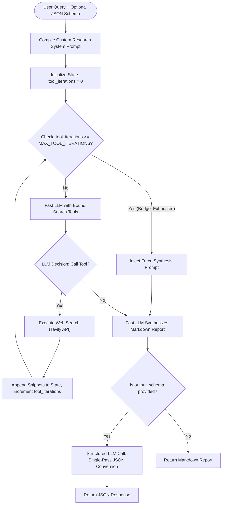

# FDE Assignment: Tavily Research Mini Lite

> **Option 1: Improve an Existing Application**
> This repository contains a highly optimized, bounded research agent implementation (**Research Mini Lite**) designed to bridge the gap between fast single-hop searches and high-latency, high-cost multi-agent research pipelines.

---

## The Core Problem

1. **High Latency for Deep Research**: Tavily Research Mini is extremely thorough but is too slow (~30s to 180s) for conversational search/chat interfaces.
2. **Standard Search is Too Thin**: The standard Tavily `/search` endpoint is fast, but lacks multi-hop reasoning capabilities (gathering facts from source A to query source B) and does not synthesize diverse sources natively.
3. **No Structured Output in Fast Search**: Standard Tavily search does not support arbitrary output schemas (JSON formats), whereas business integrations frequently demand structured data (e.g., comparative matrices, extraction tables).

## The Thesis

**Customers want synthesized, multi-hop, and structured research outputs without the latency and cost of a full Research Mini run.**

**Research Mini Lite** solves this by compiling a LangGraph-bounded agent loop that uses parallelized, single-hop Tavily `/search` calls under a strict iteration budget, followed by a post-hoc single-pass structured extraction.

---

## How It Works

Research Mini Lite runs a stateful research loop using LangGraph:



### Why it is so fast:
1. **Parallel Tool Execution**: When the LLM emits multiple tool calls in a single turn, LangGraph executes them in parallel, enabling multi-aspect search in a single round-trip.
2. **Single-Hop Endpoint**: Instead of polling a long-running research queue, it leverages Tavily's highly optimized `/search` endpoint with a configurable `search_depth` ("basic" or "advanced").
3. **Hard Budget Enforcement**: A `MAX_TOOL_ITERATIONS` guardrail ensures the agent never gets trapped in infinite search loops, forcing a synthesis step when the budget is spent.
4. **Post-Hoc Structured Extraction**: Rather than forcing the entire multi-hop planning loop to output JSON (which degrades reasoning quality and increases token usage/latency), the research runs in freeform markdown. Structured formatting is executed as a single, deterministic final pass only if requested.

---

## Technical Statement & Thought Process

### 1. Approach & Architectural Design
We selected **LangGraph** because research is inherently iterative: finding source $X$ often changes what we need to look up next (multi-hop). To maintain control over costs and latency, we decoupled the **research synthesis phase** from the **schema enforcement phase**:
* **The Research Phase**: Focuses entirely on finding information, validating facts, and generating a readable Markdown report with clear citations.
* **The Extraction Phase**: Standardizes the output into the user-specified JSON Schema in a single structured call using OpenAI's `response_format` constraint.

### 2. Value Creation
* **Technical Value**: Reduces research latency from ~30s to **3-8s** while maintaining multi-hop retrieval and full citations. It significantly reduces token complexity by avoiding recursive structured formatting.
* **Business Value**: Allows conversational AI products to offer "Deep Search" features inline in real-time chat without frustrating the user with long wait times. It reduces API usage costs by using the cheaper `/search` credits rather than `/research` credits.

---

## Project Structure

```text
FDE-Assignment/
  app.py                     # FastAPI application endpoints & configuration
  requirements.txt
  research_mini_lite/
    __init__.py
    agent.py                 # LangGraph agent definitions & loop state
    state.py                 # LangGraph state schema
    evaluation.py            # Automated multi-provider evaluation framework
    prompts/
      researcher.j2          # Custom Jinja2 prompt template for research synthesis
    tools/
      web_search.py          # Configurable Tavily search client
```

---

## Setup & Installation

### 1. Clone & Set Up Environment

```bash
cd FDE-Assignment
python3 -m venv venv
source venv/bin/activate
pip install -r requirements.txt
```

### 2. Configure Environment Variables

Create a `.env` file in the root or `FDE-Assignment` folder:

```env
TAVILY_API_KEY=your_tavily_api_key
OPENAI_API_KEY=your_openai_api_key

# Optional Customizations
OPENAI_MODEL=gpt-4o-mini
OPENAI_TEMPERATURE=0.1
MAX_TOOL_ITERATIONS=5
TAVILY_SEARCH_DEPTH=basic
TAVILY_MAX_RESULTS=5
```

---

## Running the Application

Start the FastAPI application:

```bash
python app.py
```

The server runs on `http://localhost:8000`.

---

## Usage Examples

### 1. Freeform Markdown Research Query

```bash
curl -X POST "http://localhost:8000/run" \
  -H "Content-Type: application/json" \
  -d '{"query": "What are the latest developments in room-temperature superconductors?"}'
```

### 2. Structured Schema Research Query

To receive structured JSON matching a specific schema, supply `output_schema` and `output_schema_name`:

```bash
curl -X POST "http://localhost:8000/run" \
  -H "Content-Type: application/json" \
  -d '{
    "query": "Compare recent clinical evidence for GLP-1 obesity drugs.",
    "output_schema_name": "drug_comparison",
    "output_schema": {
      "type": "object",
      "properties": {
        "summary": { "type": "string" },
        "key_findings": {
          "type": "array",
          "items": { "type": "string" }
        },
        "citations": {
          "type": "array",
          "items": {
            "type": "object",
            "properties": {
              "title": { "type": "string" },
              "url": { "type": "string" }
            }
          }
        }
      },
      "required": ["summary", "key_findings", "citations"]
    }
  }'
```

When schema parameters are included, the API returns a structured object inside the `"output_json"` field.

---

## Evaluation & Benchmarking

The workspace includes a built-in evaluation panel to benchmark **Tavily Search Advanced**, **Research Mini Lite**, and **Tavily Research Mini**.

1. Start the server: `python app.py`
2. Navigate to `http://localhost:8000` in your web browser.
3. Select or type queries and click **Run Evaluation**.
4. The dashboard records wall-clock latency, source counts, and prompts an LLM-based judge to score output quality (completeness, factual grounding, source quality, synthesis, clarity) from 1 to 5.

Every evaluation run is saved as a full JSON report in the repository-level `eval-reports/` folder. Filenames use the local date and time, for example `2026-06-09_15-04-22.json`.
